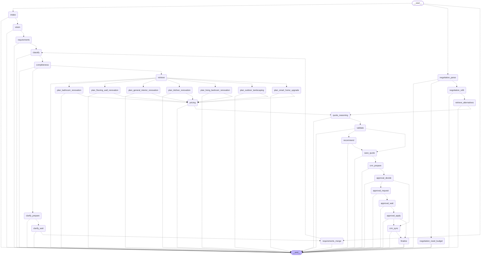

# Workflow graph

_Generated by `python -m scripts.export_docs` from the compiled LangGraph._

32 nodes. One `plan_<category>` node exists per registered project category.

## Nodes

| Node | Label shown in the UI |
|---|---|
| `approval_apply` | Record decision |
| `approval_decide` | Approval policy |
| `approval_request` | Approval request |
| `approval_wait` | Human approval |
| `clarify_prepare` | Clarification |
| `clarify_wait` | Client reply |
| `classify` | Project classification |
| `completeness` | Completeness check |
| `crm_prepare` | CRM preparation |
| `crm_sync` | CRM sync |
| `finalize` | Finalize |
| `intake` | Intake |
| `negotiation_need_budget` | Ask for budget |
| `negotiation_parse` | Understand new budget |
| `negotiation_refit` | Re-fit to budget |
| `plan_bathroom_renovation` | Scope planning · Bathroom renovation |
| `plan_flooring_wall_renovation` | Scope planning · Flooring & wall renovation |
| `plan_general_interior_renovation` | Scope planning · General interior renovation |
| `plan_kitchen_renovation` | Scope planning · Kitchen renovation |
| `plan_living_bedroom_renovation` | Scope planning · Living / bedroom renovation |
| `plan_outdoor_landscaping` | Scope planning · Outdoor & landscaping |
| `plan_smart_home_upgrade` | Scope planning · Smart-home upgrade |
| `pricing` | Pricing & timeline |
| `quote_reasoning` | Quote reasoning |
| `recommend` | Recommendations |
| `requirements` | Requirement extraction |
| `requirements_merge` | Merge new details |
| `retrieve` | RAG retrieval |
| `retrieve_alternatives` | Alternatives retrieval |
| `save_quote` | Save quote version |
| `validate` | Validation & risk |
| `vision` | Vision analysis |
